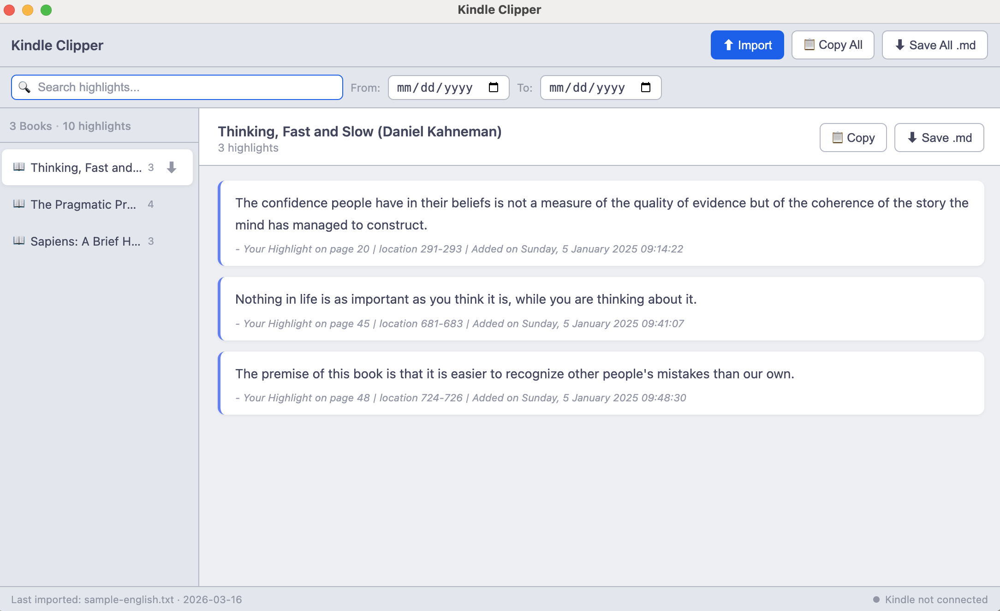
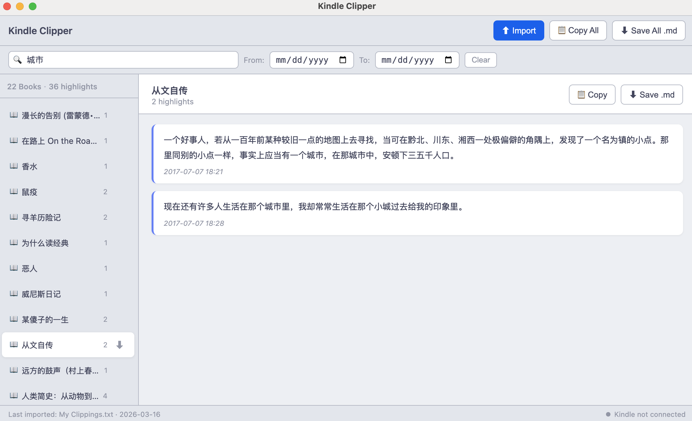

# kindle-clip-processor

Browse, search, filter, and export your Kindle highlights.

Runs as a macOS desktop app (Electron) or standalone web app — same codebase — and now also includes a standalone Go CLI named `kindle-clip` for terminal-first workflows.

## Features

- Parse `My Clippings.txt` exported from any Kindle device
- Two-panel UI: book list sidebar + highlight content pane
- Global keyword search and date range filter across all books
- Markdown export per-book or all books (copy to clipboard or save as `.md`)
- Auto-detect mounted Kindle at `/Volumes/Kindle/` (macOS)
- Browser fallback — works without Electron via file picker and clipboard API
- Standalone `kindle-clip` binary with saved-path config, Markdown-first output, and JSON output when requested

## Screenshots




## Quick Start

```bash
npm install
npm run electron:dev   # launch desktop app with hot reload
npm test               # run the TypeScript test suites
```

## CLI (`kindle-clip`)

The repo now includes a standalone Go CLI so users can run `kindle-clip ...` directly after installing a binary, without `npm run`, `tsx`, or `./` prefixes.

### Build locally

```bash
go build -o ./bin/kindle-clip ./cmd/kindle-clip
./bin/kindle-clip help
```

### Common commands

```bash
# save a default clippings directory or file once
kindle-clip set ~/Documents/Kindle

# list books using the saved path
kindle-clip list

# list books for a specific directory or file
kindle-clip list ~/Documents/Kindle --author "Daniel Kahneman"

# print all notes for one title in Markdown
kindle-clip all --title "Sapiens"

# search note text
kindle-clip search confidence

# export filtered notes to Markdown
kindle-clip export-md --title "Sapiens" --output ./sapiens-notes.md

# structured JSON is still available when needed
kindle-clip parse --json
```

### Filters

All read commands support these filters:

- `--from YYYY-MM-DD`
- `--to YYYY-MM-DD`
- `--title TEXT`
- `--author TEXT`
- `--json` for machine-readable output

By default, output is Markdown so it is easy to read in terminals, pipes, and agent sessions.

### Saved path behavior

`kindle-clip` resolves the clippings path in this order:

1. explicit file or directory argument
2. `KINDLE_CLIP_PATH`
3. saved config in `~/.config/kindle-clip/config.json` or `$XDG_CONFIG_HOME/kindle-clip/config.json`

This keeps repository directories clean while still making repeated CLI use ergonomic.

### Binary distribution with curl

The repository includes:

- `.goreleaser.yaml` for building release archives and a Homebrew formula scaffold
- `scripts/install-kindle-clip.sh` for curl-based installation from GitHub Releases

Example release install flow after setting your release repo:

```bash
curl -fsSL https://raw.githubusercontent.com/<owner>/<repo>/main/scripts/install-kindle-clip.sh \
  | KINDLE_CLIP_REPO=<owner>/<repo> sh
```

## More

- [Runbook](docs/runbook.md) — full command reference, env setup, troubleshooting
- [Design Spec](docs/superpowers/specs/2026-03-16-kindle-clipper-design.md) — architecture, data model, security
- [CLAUDE.md](CLAUDE.md) — developer and AI guide

## Archive

`archive/` contains the original Python CLI script (`kindle_clipper_processor.py`).
